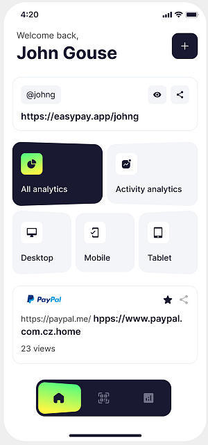

# Integration-de-maquettes

## Disclamer

Vous pouvez constater qu'il y a des différences entre la maquette et le rendu. Ceci s'explique pour plusieurs raisons:

+ je n'ai pas les images originales utilisées pour la maquette
+ je développe sous Androïd alors que souvent ces maquettes sont illustrées sous iOS
+ je n'ai pas les logos utilisées dans la maquette et je préfère trouver un logo qui ressemble mais qui est propre plutôt que d'utiliser une capture d'écran

## Easy payment app

Cette maquette vient de <a href="https://dribbble.com/shots/24860391-Easy-payment-app">dribbble.com</a>, un projet de l'agence **Emote**.

    
    

## Crypto wallet app

Cette maquette vient de <a href="https://dribbble.com/shots/24656435-Crypto-wallet-app">dribbble.com</a>, un projet de l'agence **Emote**.

    
    

## Finance App Design

Cette maquette vient de <a href="https://dribbble.com/shots/23115244-Finance-App-Design">dribbble.com</a>, un projet de **UpNow Studio**.

    

## Finance Management Mobile App

Cette maquette vient de <a href="https://dribbble.com/shots/23811381-Finance-Management-Mobile-App">dribbble.com</a>, un projet de **Shakuro**.

    

    

